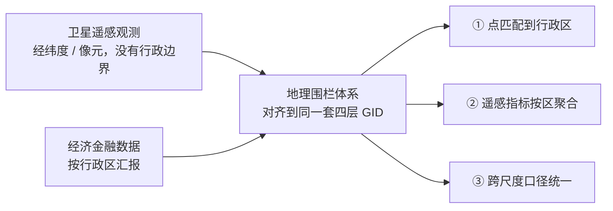
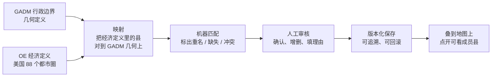
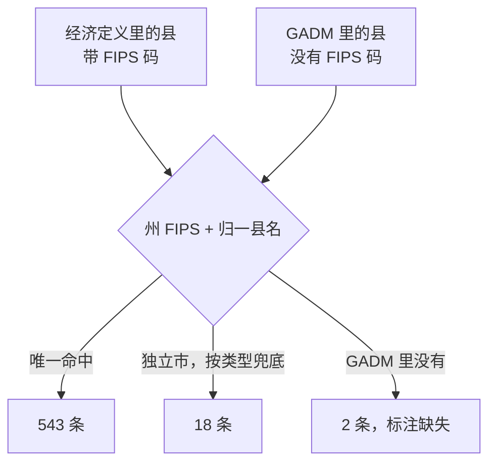

# 地理围栏体系 · Geofence & Geo-Econ System

**深圳数据经济研究院 · 卫星遥感数据研究中心**

**在线地图**：https://cangmingguoke.github.io/geofence-geoecon-system/

连接卫星遥感与行政区经济金融数据的**空间桥梁**：把没有行政边界的遥感观测（夜间灯光、土地利用、企业点位等）与按行政区汇报的经济金融数据（GDP、企业注册、人口等）对齐到同一套空间编码，支撑「天-地」数据融合与下游分析。

---

## 速览

| 内容 | 规模 | 可靠性 |
|---|---|---|
| **GADM 四层行政区划围栏**（国家 / 省州 / 市郡 / 区县） | 20 国（近五年名义 GDP 前 20）、58,510 个要素 | 国家层与省州层可靠；中国区县层**仅供粗略参考** |
| **经济定义层**（经济意义上的城市，OE 全球城市定义） | 88 个美国都市圈、563 条县级成员记录 | 匹配 561 / 563，缺口 2 处且已标注 |

**已知局限（用前必读）**

1. **中国区县层（L4）不可靠**：GADM 原始数据的区县名有全国性错位与空名，虽已按民政部县级代码表修正 444 处，仍有约 14%（约 894 个）区县在 GADM 中找不到对应几何、19 处名字与多边形对不上，**仅供粗略参考**。详见下文「中国数据警示」。
2. **涉及中国的地图不可用 GADM 出正式出版图**：GADM 将台 / 港 / 澳单列、不按中国官方主张、不含南海诸岛。精确边界请改用自然资源部标准地图（带审图号）或民政部行政区划数据。
3. **经济定义层目前只建成美国**：OE 全球城市定义共 8 个大洲、899 个城市，其余 7 洲尚未接入本管线。
4. **地图上的几何是简化版**：`GADM/map_data/` 的行政边界按 0.002 度（约 220 米）简化、都市圈图层按 0.005 度（约 550 米）简化，**不可用于面积量算**；精确边界请用院内本地的 GeoPackage。
5. **许可**：GADM 及其派生几何禁止商用、禁止再分发；OE 经济定义文件未经其书面许可不得发布或分发。
6. **数据不全在本仓库**：公开仓库只放交互地图与经济定义层产物，GADM 的原始与标准化边界、构建脚本保留在院内本地。见下节「数据获取」。

---

## 目录

- [速览](#速览)
- [项目背景与用途](#项目背景与用途)
- [数据获取](#数据获取)
- [目录结构](#目录结构)
- [一、GADM 交互地图](#一gadm-交互地图)
- [二、经济定义层（美国样例）](#二经济定义层美国样例)
  - [2.1 定位与整体框架](#21-定位与整体框架)
  - [2.2 两个核心原则](#22-两个核心原则)
  - [2.3 体系设计原则](#23-体系设计原则)
  - [2.4 人机协作分工](#24-人机协作分工)
  - [2.5 美国样例实测结果](#25-美国样例实测结果)
  - [2.6 审核与版本化设计](#26-审核与版本化设计)
  - [2.7 复现](#27-复现)
- [三、技术细节：重名消歧、唯一键与跨洲「城市」口径](#三技术细节重名消歧唯一键与跨洲城市口径)
  - [3.1 同一层级里名字重复，怎么处理](#31-同一层级里名字重复怎么处理)
  - [3.2 地图展示层的重名消歧（本轮已修复）](#32-地图展示层的重名消歧本轮已修复)
  - [3.3 经济定义层的匹配键与名称归一](#33-经济定义层的匹配键与名称归一)
  - [3.4 各大洲的「城市」口径](#34-各大洲的城市口径)
  - [3.5 目录组织与大洲归集](#35-目录组织与大洲归集)
- [术语与缩写](#术语与缩写)
- [数据来源（Tier-1）](#数据来源tier-1)
- [许可](#许可)
- [团队](#团队)

## 项目背景与用途

**研究定位（整理自课题组《总览》）**：卫星遥感数据本质上是一种**客观的物理信号**，与财报、调研数据的根本区别在三点。

- **非欺骗性**：财报是企业按会计准则加工出来的，带管理层主观色彩（利润调节、减值计提），这就是计量经济学里的内生性问题。卫星捕捉的是最底层的物理活动：厂区夜间灯光、热辐射、停车场车流、堆场体积，企业很难造假。相当于报表是企业自画的「自画像」，卫星是外界拍的高清无滤镜监控。
- **实时性**：财报按季或按年披露，最快的高频调研也要人工核实，存在信息衰减。卫星以天甚至小时为单位更新，能抓住企业经营的突变点。谁能最快捕捉到「还没被市场消化的物理信号」，谁就抢得先机。
- **上帝视角**：不受单个企业或一条产业链的限制，能同时看到目标企业、它的上游供应商和下游经销商的物流与生产动向，为行业对比和基本面交叉验证提供底层证据。

**两大研究落脚点**：一是**资产定价**，先有数据、再落脚到资产定价，把物理信号因子化后回测，检验这些被市场忽视的信号能否领先于财务报表、预测企业未来现金流，从而转化为超额收益因子；二是**公司金融**，用客观信号穿透报表「滤镜」，物理信号像一次不打招呼的「CT 扫描」，真实反映企业的产供销情况与 ESG 合规状况，缓解管理层会计自由裁量权带来的信息不对称，辅助估值、监管与风险管理。

**本体系在其中的位置**：以上两条线都要求把遥感观测与经济金融数据对齐到同一空间口径。卫星观测以经纬度 / 像元为载体，经济金融数据以行政区划为口径，两者天然「天-地」分离。本体系就是二者之间的**空间桥梁**，解决三类问题：

- **点 → 行政区空间匹配**：任意经纬度（遥感像元、POI、企业点位）可落到国家 / 省州 / 市郡 / 区县四层，返回统一 GID 编码（GADM 全局唯一行政区编码，形如 `USA.47.40_1`）。
- **遥感指标行政聚合**：把栅格遥感观测按行政边界聚合为省州 / 市郡 / 区县级指标，作为经济活动与城市化的空间代理变量。
- **跨尺度口径统一**：以同一套四层 GID 编码对齐多来源、多分辨率数据，支撑面板回归、空间计量等下游分析。




---

## 数据获取

| 内容 | 位置 |
|---|---|
| 交互地图（`GADM/interactive_map.html`）与各国**简化边界几何**（`GADM/map_data/*.js`） | **本公开仓库**，浏览器直接打开页面即可用 |
| 国家清单（排名 / 国家 / 大洲 / 各层要素数） | 本仓库 `GADM/countries.csv` |
| 经济定义层**全部产物**：成员表、匹配结果、FIPS↔GADM 代码桥、都市圈边界（GeoJSON / GeoPackage）、审核与版本记录、生成脚本 | 本仓库 `经济定义/美国样例/` |
| GADM 的**原始下载与标准化边界**（`GADM/raw/`、`GADM/geojson/`、`GADM/gpkg/`）与构建脚本（`GADM/scripts/`） | **院内本地，不在公开仓库**（GADM 许可不允许再分发原始边界数据） |

需要完整四层 GeoJSON / GeoPackage 或构建脚本，请联系课题组。

**想直接上手**：先看效果就浏览器打开 `GADM/interactive_map.html`；要在 Python 里读边界或做点与行政区的空间匹配，见 `GADM/README.md` 的「使用方法」（`geopandas` 读 GeoJSON、`match_points` 做点匹配）；要复现经济定义层，见下文 2.7。

---

## 目录结构

| 目录 | 内容 |
|---|---|
| `GADM/` | 全球四层行政区划交互地图（近五年名义 GDP 前 20 国），含 `GADM/map_data/` 各国边界几何 |
| `经济定义/美国样例/` | 经济都市圈定义研究管线（美国样例，01-09 全流程产物），说明见本 README 第二节 |

---

## 一、GADM 交互地图

覆盖近五年名义 GDP 前 20 国的**国家 / 省州 / 市郡 / 区县**四级行政区划，自研 Canvas 矢量渲染器（非 Leaflet），支持大洲/国家切换、L1-L4 层级缩放、城市中英文标注切换、滚轮缩放/拖拽平移、悬停显示、搜索高亮（中文/拼音，按唯一 GID 定位避免同音歧义）。

数据源与构建流程、字段字典、覆盖范围、中国数据处理细节（台湾省级并入、区县 GB/T 2260 审计修复等）详见 `GADM/README.md`。

**坐标与精度**：所有边界的坐标系为 **WGS84 / EPSG:4326**（经纬度），未做投影转换；面积统计在 **EPSG:5070**（北美等积投影）下计算。地图加载用的 `GADM/map_data/*.js` 是**简化几何**（0.002 度，约 220 米），只适合展示与点选，**不可用于面积量算**；精确边界用院内本地的 `GADM/gpkg/*.gpkg`（QGIS 可直接打开，每国一个文件、含 L1-L4 四层）。

> **中国数据警示**：GADM 的中国区县层（L4）存在全国性的名字错位与缺失问题，已用民政部县级区划代码（GB/T 2260）做了一轮审计与批量修复（确定性修正 444 处），但仍有约 894 处（约 14%）区县在 GADM 中无对应几何、19 处名字与多边形不符，**仅供粗略参考**；省（L2）、市（L3）两层相对可靠。详见 `GADM/README.md`。

---

## 二、经济定义层（美国样例）

本节的原则与流程整理自课题组 2026-09-08 组会（手写研究框架图整理稿），人员分工与产品形态以该次讨论为准。

### 2.1 定位与整体框架

体系有两类核心输入，通过 mapping 进入同一套**地理经济管理体系**：

| 输入 | 提供什么 |
|---|---|
| **GADM Geofence** | 全球行政区划层级及对应的地理围栏，是行政地理底座 |
| **OE 经济定义**（Oxford Economics《Global Cities》，Global_Cities_Definitions） | 经济指标与经济城市口径 |

管理体系的用途是**联动卫星遥感数据与金融经济指标**，让不同空间维度的数据能在共同的地理范围内匹配、管理和分析。

#### 整体研究框架

组会手写图给出的流程，画成图就是：



**本阶段范围**：只做美国样例。全球其他国家、卫星数据接入、Google Maps 自动融合都不在本阶段。

归纳来看，手写图描述的**不是一张单纯的地图**，而是一套以现有产品为底座、以行政几何与经济口径映射为核心、能够持续维护并支持人工审核的**地理经济基础数据库**。它将成为后续卫星遥感研究、经济指标匹配与企业化服务的共同空间基础设施。

#### 与既有产品雏形的关系

组会明确**不要求从零开发另一套产品**。已有 geofence-map 已完成 GADM 行政围栏、分层组织与交互可视化的初步雏形，相当于先做出了产品流程的展示端与行政地理底座。下一阶段是在该雏形之上增加三项能力：

1. 接入经济定义；
2. 把经济文本定义映射到既有行政几何；
3. 加入机器候选、人工审核与版本记录。

最终仍回到现有地图中展示和调用。这也是本层产物以**纯增量集成进产品地图**、而不是另起独立演示的形式交付的原因：早期一版独立的 Leaflet 演示因与产品风格脱节已被弃用，仅留作参考（见 `经济定义/美国样例/09_阶段演示说明.md` 的附录）。

### 2.2 两个核心原则

#### 原则一：几何定义和经济定义是两套定义，冲突时以经济定义为准

| 定义体系 | 主要作用 | 处理原则 |
|---|---|---|
| **Geometry definition** | 描述国家、州省、城市或区县在几何上的行政边界，主要由 GADM 提供 | 作为稳定的行政层级、标识符与 Polygon 几何来源 |
| **Economic definition** | 描述 GDP 等经济指标实际采用的统计或核算范围，可能由若干较小行政单元组合而成 | 最终分析对象是经济活动，**发生冲突时原则上优先作为基准** |

**冲突处理**：几何定义与经济定义冲突时**以 economic definition 为基准**。Google Maps 可在后续作为辅助参照与佐证来源，但**不能在缺少判断依据时自动覆盖经济定义**。

**实际构造方式**：把经济定义文本中列出的县、村镇或其他基层单元，与 GADM 中对应的几何单元做匹配，再通过增减与微调，把这些「小积木」组合成符合经济定义的城市或都市圈围栏。

#### 原则二：层级至少四级，其中第三级「市 / 郡」被特别强调

| 层级 | 本体系 | GADM 层级 |
|---|---|---|
| 国家 | L1 | ADM0 |
| 省 / 州 | L2 | ADM1 |
| **市 / 郡**（近似城市层） | L3 | ADM2 |
| 区县 | L4 | ADM3 |

手写框架图尤其强调第三级（上表的「市 / 郡」）。原因是**城市尺度既不会过大、也不会过小**，是国际上较常用于观察和核算经济活动的空间单位，同时能承接研究与实践两方面不断增长的需求。

> 注意：GADM 没有独立的「城市」层，L3 只是「近似城市层」，各国语义并不一致（美国是县、中国是地级市、德国是 Kreis）。一致的城市口径由本层提供。详见 3.4 节。

### 2.3 体系设计原则

手写框架图提出参考 **STAC**（遥感数据目录体系）与 **RS DBMS**（遥感数据库管理系统）的组织思路。要做到四点：**层级清晰、标识稳定、记录来源、管理版本**。

扩展方式类比卫星系列：MODIS、Landsat、Sentinel 可以并列接入，每个系列下面再分卫星、传感器、波段。地理经济体系也按这个方式扩展国家、地区、层级和定义来源。

体系不能只存一次边界结果，还要能承接行政区划、经济口径和数据版本的变化，支持增、删、改。

### 2.4 人机协作分工

理想状态是系统读入一段经济定义文本后，自动识别空间单元、匹配几何边界并完成质量判断；**当前阶段先实现可解释、可审核的人机协作**。

| 机器承担 | 人工承担 |
|---|---|
| 批量读取与标准化文本；生成行政单元候选匹配；组合围栏；标记重名、缺失、冲突和不确定项；保存来源与版本 | 判断机器无法可靠处理的重名、翻译和边界冲突；增加或删除单元；核对是否完整覆盖经济定义；点击确认并记录审核理由 |

**闭环**：机器提出匹配结果与异常提示，人工只处理少量需要判断的案例，审核结果回写系统并形成可追溯的新版本。后续如果计算机视觉与几何算法足够成熟，再逐步减少人工审核比例。

### 2.5 美国样例实测结果

| 项 | 数值 |
|---|---|
| 都市圈总数 | 88（Metropolitan Statistical Area） |
| 县级成员记录 | 563（覆盖 44 州） |
| 匹配成功 | 561 / 563 = 99.6% |
| 　按州 FIPS（美国县联邦代码，2 位州 + 3 位县）+ 归一县名精确命中 | 543 |
| 　按类型感知兜底（弗吉尼亚独立市） | 18 |
| 缺失 | 2（Baltimore City、St. Louis City） |
| FIPS↔GADM 代码桥 | 561 条，`fips5` 与 `gid_2` 各自 1:1 零碰撞 |
| 围栏面积范围 | 1,565 至 71,049 km²，中位 10,918 km² |
| 质量检查 | 0 重复成员 / 0 空几何 / 0 无效几何 / 0 真实面积异常 |

最大为 USM18 Riverside-San Bernardino-Ontario, CA（71,049 km²，2 个巨型县，全美最大 MSA），最小为 USM35 Urban Honolulu, HI（1,565 km²，1 个县）。

**唯一的 2 处缺口**：GADM 的美国县层**没有巴尔的摩市与圣路易斯市的独立要素**，其辖区被并入同名县多边形，因此这两市的面积**已包含**在围栏里，但**无法单独归属**。对应都市圈 USM02、USM23 在两地图上标为橙色。具体几何证据见 `GADM/README.md` 的「已知几何与属性缺陷（美国层）」。

> 表中「51 州」= 50 个州 + 哥伦比亚特区（GADM 把 DC 记为 `FederalDistrict`，算作州级单元）；「覆盖 44 州」指有县入选这 88 个都市圈的州数。两者口径不同，不是矛盾。

### 2.6 审核与版本化设计

| 设计原则 | 落实方式 |
|---|---|
| 原始数据不可覆盖 | `07_美国都市圈成员关系.csv` 只读，审核工具从不改写它 |
| 追加式审计日志 | 每个动作追加一行 `08_审核日志.csv`，永不删除、可完整回溯 |
| 状态幂等重算 | 审核状态 = 机器结果 + 日志，`status` 命令随时重算，不存可变中间态 |
| 版本随动作递增 | 每个都市圈 `version` = 作用于它的审核动作数 |

**5 类审核动作**：`approve_metro`（通过全部已匹配成员）、`mark_missing`（确认缺失、留缺口）、`replace_member`（替换成员几何）、`add_member`（新增成员）、`delete_member`（标记删除，不物理删除）。

**演示闭环结果**（2026-09-11）：90 个动作 = 88 个 `approve_metro` + 2 个 `mark_missing`；approved 561 条、confirmed_missing 2 条、pending 0；88 个都市圈全部版本化（USM02、USM23 为 v2）。

> 注意：本轮 reviewer 填的是「科研助理(演示)」，仅用于跑通闭环。**真正的人工审核需由黄丰老师用 `08_审核工具.py reset` 清空后重跑**，届时 reviewer 改为实际审核人。

### 2.7 复现

**环境**：Python 3.12（实测 3.12.4），依赖见 `GADM/scripts/requirements.txt`：

```bash
pip install -r GADM/scripts/requirements.txt   # geopandas>=1.0、pyogrio>=0.10、requests>=2.31
```

```bash
cd 经济定义/美国样例

# 步骤 8：审核与版本化（原生数据只读，日志追加）
python 08_审核工具.py init                                  # 初始化，全部 pending
python 08_审核工具.py status                                # 重算状态/版本并写出
python 08_审核工具.py approve-all --reviewer 黄丰 --reason "..."
python 08_审核工具.py mark-missing USM02 24510 --reviewer 黄丰 --reason "..." --evidence "..."
python 08_审核工具.py reset                                 # 清空日志/状态/版本，重新开始

# 步骤 9：从 07/08 产物生成地图图层数据
python 09_生成经济图层.py
```

生成后 `GADM/map_data/USA_metro.js` 会被覆盖，地图端由 `interactive_map.html` 自动加载（`USA_METRO` + `USA_METRO_SEARCH`）。几何为演示简化版（0.005 度，约 550 米），精确边界以 `07_美国都市圈边界.gpkg` 为准。

---

## 三、技术细节：重名消歧、唯一键与跨洲「城市」口径

本节把体系的每一处技术处理交代清楚，便于复现与审计。

### 3.1 同一层级里名字重复，怎么处理

**问题有多大。** GADM 把美国的县（L3）一共列了 3,148 个，其中只有 1,839 个名字不重复，剩下 **442 个名字被用在不止一个县上**，最多的是 Washington，有 31 个县都叫这个名字。程序如果按名字认地方，这 31 个会被当成同一个。各国的重名对照表在 `GADM/README.md`。

**基本规则：名字不当主键，用 GID。**

GADM 给每个行政区编了一个全库唯一的编号 `GID_N`（形如 `USA.16.92_1`），这就是本体系的主键。做匹配、去重、关联一律用它；名字只用来显示给人看。每条下级记录里还带着指向上级的外键（`GID_1`、`GID_2`），要上级信息顺着外键取就行。

剩下两种特殊情况要单独处理。

**情形一：同一个州里，县和市同名（弗吉尼亚独立市）。**

Fairfax 县和 Fairfax 市是两块分开的地。GADM 把它们做成了两条独立记录，但给的简称代码 `HASC` 是一样的（都叫 `US.VA.FC`）。这个代码是按名字缩写生成的，名字一样代码就一样，所以它也不能当主键。美国 L3 层一共 8 组这样的撞码。

做法是：名字规范化时**特意保留 `city` 这个尾巴**，让两者成为不同的键。实测 Fairfax 县落到 `USA.47.40_1`，Fairfax 市落到 `USA.47.41_1`，各自正确。

**情形二：同名，但 GADM 里只有一条记录（巴尔的摩市、圣路易斯市）。**

GADM 里只有一条叫 Baltimore 的记录，没有单独的巴尔的摩市，市的辖区被并进了县那块多边形。这种没法靠数据本身拆开，只能标成缺失、图上标橙色。

这不等于围栏破了个洞。实测那条 Baltimore 的面积是 1,794 km²，约等于巴尔的摩县的 1,549 加巴尔的摩市的 210，市的中心点也确实落在多边形内部。**缺的不是面积，是没法把这个市单独拎出来**。所以按县做人均之类的计算时，分母里其实已经含了这个市。几何证据见 `GADM/README.md`。

**结果**：改用「州编号 + 名字」这种双重条件后，3,148 个县里同州同名的组合为 0 组；88 个都市圈之间没有任何一个县被两个都市圈共用。

### 3.2 地图展示层的重名消歧（本轮已修复）

**改前的两处缺陷。**

- 检索索引条目**不带父级信息**，下拉副标题只显示「国家 · L层级」，于是 **4,038 组**同名条目在下拉里长得完全一样（`Merkez` ×73、`Washington` ×32、`Jungang` ×31），必须点开才知道选中了哪一个。选中本身没错（按 `gid` 定位），错的是候选列表无法辨认。
- 中文词典**按「名称」建键、不分层级**，省级译名被套到县级要素上。L3/L4 层有 **176 条**中文名以「州 / 省 / 自治区 / 地区 / 道」结尾，最典型的是 31 个 Washington **县**被显示成「华盛顿州」。

**怎么解决的。**

- **给每条行政区检索项补一个「上级」字段**，取自 GADM 行自带的祖先字段（ADM2 行带 `GID_1` / `NAME_1`，ADM3 行带 `GID_2` / `NAME_2`）。下拉副标题由「国家 · L层级」改为「国家 · 上级 · L层级」，同名项按上级排序成组相邻。父级取不到时用「精确 GID → 去版本后缀 → 子行自带父级名」三级兜底，覆盖率 **99.98%**（57,886 / 57,895，剩 9 条英国要素留空）。父级**不能靠 GID 字符串截断推导**：GADM 的 `_N` 后缀是版本号，父子两层并不一致（如巴西 `BRA.1.1_2` 的父级是 `BRA.1_1`）。
- **中文译名按层级约束**：同时满足「该名确实是本国省名」与「译名带省级后缀」两条，才判定为省级译名误套并置空，界面回退显示英文名。两条都必要：只按同名判定会误伤「吉林市」「北京」这类本身正确的译名，不加后缀条件又会清掉日本「山形」、瑞士「沙夫豪森」这类不带后缀、本身没错的译名。规则只作用于词典路径，中国走 GADM 自带 `NL_NAME`，按 GID 精确取值。

**修复结果。**

| 项 | 改前 | 改后 |
|---|---|---|
| 检索条目总数 | 58,667 | 58,667（每条行政区多一个 `p` 上级字段） |
| L3/L4 条目带上级标签 | 0 | 57,886 / 57,895 = **99.98%** |
| L3/L4 中文名带省级后缀 | 176 条 | 79 条（77 条为中国 GADM 自带 `NL_NAME`，本就正确；2 条为韩国清州 / 全州，本就正确） |
| 下拉能否区分同名 | 否 | 是（`Washington` ×32 各自显示所属州，同名项按上级排序成组相邻） |

共清空 97 条，其中 **95 条是错误译名、2 条是刻意接受的代价**：加拿大育空地区、韩国济州市的正确译名本身就带省级后缀，被一并清空，界面回退显示英文名。

改动只落在 `GADM/scripts/build_interactive_map.py` 一个文件，`GADM/interactive_map.html` / `GADM/index.html` / 脚本内 HTML 模板三者字节一致，重跑构建后各国 `GADM/map_data/{ISO3}.js` 字节不变，只有 `_search.js` 与两份 HTML 变化。

完整的实现细节与校验方式见 `GADM/README.md` 的「检索与标注的消歧实现」一节。

### 3.3 经济定义层的匹配键与名称归一

**要解决的问题**：经济定义那张 Excel 里，每个县都带 FIPS 代码（5 位，前 2 位是州、后 3 位是县）。而 GADM 的县层没有这个代码（`CC_2` 字段全空）。两边要关联，却没有共同的字段，所以得自己建一张对照表。

#### 匹配键：为什么用「州 FIPS + 归一县名」而不是名称或 HASC




- **不能只用名称**：美国 L3 层 3,148 个县里只有 1,839 个不重复名，**442 个名字重复**，最重复的 Washington 有 31 个同名县（各国对照见 3.1 节）。
- **不能只用 HASC**：GADM 的 `HASC_2` 由名称推导，**同名即同码**。美国 L3 层共 8 组撞码，既有 Fairfax、Roanoke、Bedford 三对同名县与独立市，也有 5 组水体撞县，逐条见 3.1 节情形二。
- **正解**：「州 FIPS + 归一县名」复合键。实测 3,148 个县中「同州 + 同名」组合为 **0 组**，563 条记录的 `gid_2` 与 `fips5` 各自 0 重复，88 个都市圈之间**没有任何县被两个都市圈共用**。
- **名称归一规则**（落在 `county_name_norm` 字段）：转小写；`St.` 展开为 `Saint`；去掉类型后缀 `County / Parish / Borough / Municipality / District / Census Area / City-and-*`；但**保留 `city`**（load-bearing，防止独立市被静默错配到同名县）。

#### 其它数据处理要点

- **水体要素须剔除**：美国 L3 层含 11 个 `TYPE_2 = Waterbody` 的五大湖水体，不是县。真县等价单元 3,148 − 11 = 3,137。实测 563 条匹配成员中 0 个水体。
- **Excel 末尾脚注**：North America 表末尾 5 行是 Notes / CBSA / SGC 说明，非县记录，已剔除，真县记录 = 563 条。
- **州 FIPS 补零**：Excel 里州码有 int 与 str 两种类型，需统一补零后再拼 5 位县 FIPS。
- **Excel 名称差异**：GADM 用 `Saint`、Excel 用 `St.`；弗吉尼亚独立市命名不自洽（Excel 一律写 `X city`，GADM 多数去掉 `City` 后缀，仅 4 个保留）。

### 3.4 各大洲的「城市」口径

**先澄清一点：GADM 里没有「城市」这一层。** 本体系的 L3（ADM2）只是「近似城市层」，各国语义不一样：美国是县、中国是地级市、德国是 Kreis、法国是 département；层级深度也不同（美国到 ADM2、中国到 ADM3、法国到 ADM5）。

所以「城市」这个概念不是从行政层级来的，而是**从经济定义来的**。OE 全球城市定义（`Global_Cities_Definitions_Oct19`，Oxford Economics，2019-10）按大洲分了 8 张 sheet，每张自己对「城市」下定义，一共 899 个城市：

| 大洲 | 城市数 | 「城市」怎么定义、成员单元是什么 |
|---|---|---|
| 北美洲 | 98 | 美国用 MSA（88 个）、加拿大用 CMA（10 个）。成员是县 / 市镇，带 FIPS、SGC 代码 |
| 中国 | 150 | 132 个地级市 + 14 个副省级市 + 4 个直辖市。**没有成员单元列** |
| 欧洲 | 232 | 主要用 OECD / Eurostat 的 FUA。成员是 NUTS 区，带 NUTS 代码 |
| 亚洲 | 173 | 定义最杂，20 余种；成员粒度从 Census Town 到 Ward 都有 |
| 拉丁美洲 | 104 | 多用 Metropolitan Area。成员是市镇，但代码列整列全空 |
| 非洲 | 102 | 定义 17 种；成员多为一级行政区，没有代码列 |
| 中东 | 29 | 多用 City Proper。成员是省 / 酋长国，没有代码列 |
| 大洋洲 | 11 | 澳大利亚用统计区、新西兰用 Regional Council，成员是 SA4 |

**归集的做法**：经济定义那张表里，每个城市下面会列出它由哪些小单元组成。比如亚特兰大下面列了 29 个县。拿这些小单元去 GADM 里找到对应的边界，再把它们拼起来，拼出来的形状就是这座城市在地图上的样子。纽约都市圈是 25 个县拼的，分属新泽西、纽约、宾州三个州，因为中间跨了哈德逊河和长岛湾，拼出来不是一个整块，而是 177 个不连续的部分。

**难的地方有三个：**

**跨洲归集的三个卡点（尚未解决）：**

1. **中国无法按美国的方式做成员并集**：中国 sheet 只有 4 列城市清单，没有任何成员单元列，而中国 L3 已经是地级市（本身就是行政建制市），要再往下就得用 L4 区县，而中国 L4 是 GADM 问题最重的一层。
2. **成员代码只有北美与欧洲可用**：美国有 3 位县 FIPS、加拿大有 7 位 SGC、欧洲有 NUTS 代码；拉丁美洲的代码列整列全空，非洲、中东、中国**根本没有代码列**。这些洲只能退化为「名称匹配」，而名称恰恰是本体系最不可靠的键（见 3.1）。
3. **各大洲表结构不同**（4 / 6 / 7 / 9 列四种），列名也不统一（北美的成员代码列叫 `Local regional level code`，其余洲叫 `Local region code`），跨洲泛化需要按洲写适配器。

**当前进度**：只建成了北美洲分支中的美国部分（88 个 MSA、563 条县级成员、561 条匹配成功），其余 7 洲的城市定义**尚未接入本管线**。

### 3.5 目录组织与大洲归集

- **地图端已按大洲分组**：国家清单见本仓库的 `GADM/countries.csv`（排名 / 国家 / 大洲 / 各层要素数，20 行），地图按大洲分组显示，洲间按「洲内最靠前 GDP 排名」排序（北美洲 USA=1 → 亚洲 CHN=2 → 欧洲 DEU=3 → 南美洲 → 大洋洲）。更全的元数据（ISO 码、层级可用性、舍弃的更深层级）在院内本地的 `GADM/country_list.csv`。
- **静态交付物目前按国家平铺**：`GADM/geojson/` 与 `GADM/gpkg/` 下是 20 个 `ISO3_中文名` 目录，**未按大洲建子目录**。定位函数 `locate_country_dir` / `locate_geojson_dir` 已同时兼容「平铺 / 大洲子目录」两种布局，改布局不需要动下游脚本。
- **大洲归属的约定**：俄罗斯归欧洲、土耳其归亚洲（二者跨洲）。

---

## 术语与缩写

| 缩写 / 术语 | 含义 |
|---|---|
| GID | GADM 的全局唯一行政区编码，本体系的空间主键（如 `USA.47.40_1`）。层级内唯一，跨层级靠父级 GID 前缀嵌套 |
| ADM0 / ADM1 / ADM2 / ADM3 | GADM 的行政层级编号，依次对应本体系的 L1 / L2 / L3 / L4 |
| OE | Oxford Economics（牛津经济研究院），《Global Cities》经济定义数据的出品方 |
| MSA | Metropolitan Statistical Area，美国都市统计区。跨县的经济功能区，本体系美国样例的「城市」口径 |
| CBSA | Core Based Statistical Area，美国核心统计区，MSA 的上级统称；本体系沿用其 2015 年划界 |
| FIPS | 美国联邦信息处理标准代码。「县 FIPS」为 5 位：前 2 位州码 + 后 3 位县码（如 `24510` = 马里兰州巴尔的摩市） |
| HASC | Hierarchical Administrative Subdivision Codes，层级行政区划代码（如 `US.VA.FC`）。本体系只作参考字段，**因同名同码不能当主键** |
| SGC | Standard Geographical Classification，加拿大统计局标准地理分类代码（7 位） |
| NUTS | 欧盟地域统计单元分级，欧洲成员单元的代码体系 |
| FUA | Functional Urban Area，功能城市区，OECD / Eurostat 定义的欧洲「城市」口径 |
| SA4 | Statistical Area Level 4，澳大利亚统计局的一级统计地理单元 |
| LGA / Kism | 非洲国家的行政区类型（Local Government Area 地方政府区；Kism 为埃及的区） |
| Polygon / MultiPolygon | 矢量几何类型。Polygon 是连成一片的一块；MultiPolygon 是分成多块不连续（如跨河的都市圈） |
| GeoJSON / GeoPackage | 两种矢量数据格式。前者是文本、便于交换；后者是单文件数据库容器，QGIS 可直接打开、一个文件含多个图层 |
| NL_NAME | GADM 自带的中文本地名字段，形如 `江蘇\|江苏`（取 `\|` 后的简体段） |
| USM 编号 | 本体系给 88 个美国都市圈自编的序号，形如 `USM01`、`USM13`。编号落在 USM01 至 USM107 之间且**中间有跳号**（共 88 个），并不是 1 到 88 连续；USM01 = Atlanta、USM13 = New York |
| Kreis / département | 德国 / 法国的二级行政区，即本体系 L3 在德法的实际对应物 |
| census subdivision | 加拿大统计体系下的市镇单元，即加拿大 CMA 的成员单元 |
| Canvas / Leaflet | 两种地图渲染方式。本产品是自研 Canvas 矢量渲染器（手写投影与命中判断），不是 Leaflet 库 |
| POI | Point of Interest，兴趣点（企业、设施等点位数据） |
| load-bearing | 关键、不可省（本体系的用例：归一县名时必须保留 `city` 后缀，否则独立市会错配到同名县） |

---

## 数据来源（Tier-1）

- **GADM 4.1**（Database of Global Administrative Areas，全球行政区划数据库）：https://gadm.org/
  - 引用：*GADM database of Global Administrative Areas, version 4.1.* https://gadm.org/ （accessed 2026-08-30）
- **OE 全球城市经济定义**：Global_Cities_Definitions_Oct19（Oxford Economics，2019-10），美国部分取自 North America 表。口径自述为 Metropolitan Statistical Area（CBSA 2015 划界）。该文件版权归 Oxford Economics，**未经书面许可不得发布或分发**。

**引用本体系**：*地理围栏体系（Geofence & Geo-Econ System）*，深圳数据经济研究院 · 卫星遥感数据研究中心（张博辉教授 / 黄丰博士后团队），2026。在线地图：https://cangmingguoke.github.io/geofence-geoecon-system/

---

## 许可

- **GADM 4.1**：免费用于学术与非商业用途，**禁止再分发、禁止商业用途**。本仓库内由 GADM 派生的边界几何（`GADM/map_data/` 下的各国边界，以及 `经济定义/美国样例/` 下的 geojson / gpkg）仅限科研使用。
- **OE 全球城市经济定义**：版权归 Oxford Economics，**未经其书面许可不得发布或分发**。本仓库 `经济定义/美国样例/` 下的成员表与都市圈边界均由该文件派生，同样受此限制。
- **中国边界说明**：GADM 将台 / 港 / 澳单列、不按中国官方主张、不含南海诸岛；涉及中国的地图不可用 GADM 出正式出版图。精确的中国边界请改用自然资源部标准地图（带审图号）或民政部行政区划数据。

---

## 团队

深圳数据经济研究院 · 卫星遥感数据研究中心（张博辉教授 / 黄丰博士后团队）。

数据申请、问题反馈与协作需求请联系课题组。本仓库的边界数据与构建脚本仅限院内科研使用。
